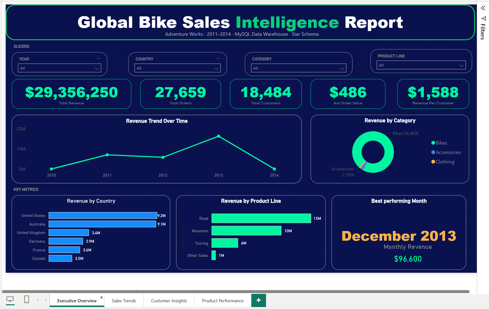
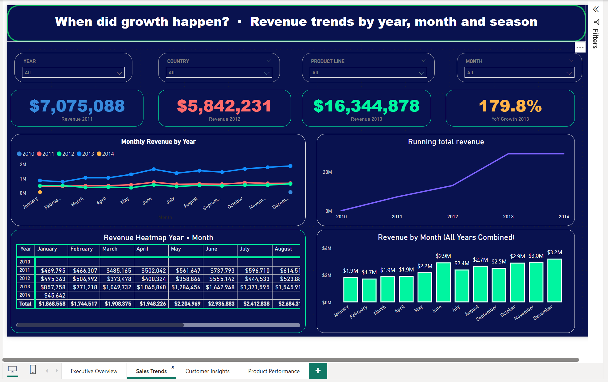

# 📊 Data Warehouse & Analytics Engineering Project

This repository showcases an end-to-end **Data Warehouse and Analytics solution**, demonstrating practical experience in **Data Engineering, Analytics Engineering, and Business Intelligence workflows**.

The project highlights my ability to design scalable data systems, build ETL pipelines, model analytical datasets, generate business-ready insights using **MySQL**, and visualise findings in **Power BI**.

---

## 🚀 Project Summary

This project simulates a real-world business environment where data from two operational source systems — a **CRM** and an **ERP** — must be consolidated into a centralised warehouse for reporting and analytics.

**Dataset:** AdventureWorks (Microsoft) — fictional global bike company  
**Tutorial credit:** [Data With Baraa](https://github.com/DataWithBaraa/sql-data-warehouse-project)

### Key Objectives

- Design and implement a modern data warehouse using the Medallion Architecture
- Build structured ETL pipelines with stored procedures and error handling
- Apply data cleaning and transformation best practices across 6 source tables
- Develop an optimised Star Schema model for analytics consumption
- Generate actionable business insights through SQL analytics
- Build an interactive Power BI dashboard connected directly to the warehouse

---

## 🏗️ Architecture Overview

The solution follows the **Medallion Architecture (Bronze → Silver → Gold)** framework.


```
CSV Source Files (CRM + ERP)
          ↓
  🥉 BRONZE LAYER    → Raw ingestion — no transformation
          ↓
  🥈 SILVER LAYER    → Cleaned, typed, standardised data
          ↓
  ⭐ GOLD LAYER      → Business-ready Star Schema (Views)
```

### 🥉 Bronze Layer — Raw Ingestion

- Loaded 6 CSV files from CRM and ERP source systems into MySQL using `LOAD DATA INFILE`
- Preserved raw structure exactly as received for full auditability and traceability
- Stored procedure (`load_bronze`) truncates and reloads all tables on each run
- Includes batch timing, per-table duration logging and error handling

### 🥈 Silver Layer — Data Transformation

- Applied 13 types of data transformations across all 6 source tables
- Key transformations: deduplication, trimming, type casting, standardisation, date rebuilding using `LEAD()`, business rule enforcement, invalid value handling and data integration
- Stored procedure (`load_silver`) manages full Silver reload with logging and error handling
- Quality checks validate every table after each load

### ⭐ Gold Layer — Analytics Layer

- Designed a Star Schema with 2 dimension views and 1 fact view
- `gold_dim_customers` — unified from 3 Silver tables (CRM + ERP)
- `gold_dim_products` — unified from 2 Silver tables (CRM + ERP), current products only
- `gold_fact_sales` — 60,398 transactions with surrogate key lookups to both dimensions
- All Gold objects are SQL **VIEWS** — no physical storage, always reads latest Silver data

---

## 🗂️ Data Model

The Gold layer follows a **Star Schema** pattern:

```
gold_dim_customers (1) ──────── (Many) gold_fact_sales
                                              │
gold_dim_products  (1) ──────── (Many) gold_fact_sales
```

| Table | Type | Rows | Primary Key |
|---|---|---|---|
| `gold_dim_customers` | Dimension | 18,484 | `customer_key` (surrogate) |
| `gold_dim_products` | Dimension | 295 | `product_key` (surrogate) |
| `gold_fact_sales` | Fact | 60,398 | `product_key` + `customer_key` (FK) |

---

## 📊 Power BI Dashboard

Connected directly to the MySQL Gold layer via ODBC. The dashboard tells the full business story across 4 interactive pages with DAX measures and cross-page slicers.

**Key metrics:**

| Metric | Value |
|---|---|
| 💰 Total Revenue | $29,356,250 |
| 👥 Total Customers | 18,484 |
| 📦 Total Orders | 27,659 |
| 🛍️ Avg Order Value | $486 |
| 💳 Revenue Per Customer | $1,588 |

---

### Page 1 — Executive Overview
> The full picture at a glance



---

### Page 2 — Sales Trends
> When did growth happen?

Revenue dropped **18% in 2012** then exploded **+180% in 2013** — from $5.8M to $16.3M in a single year.



---

### Page 3 — Customer Insights
> Who is buying?

The US has **40.5%** of all customers but **Australia spends the most per order at $678** — 50% more than a US customer.


---

### Page 4 — Product Performance
> What is selling?

**Bikes generate 96.5% of all revenue.** The Mountain-200 series holds every single top 5 product slot.


---

## 🔍 Key Business Findings

| Finding | Insight |
|---|---|
| 🚲 **Revenue concentration** | Bikes = 96.5% of $29.4M. Accessories and Clothing barely register |
| ⛰️ **Hero product** | Mountain-200 series dominates all top 5 revenue positions |
| 🌏 **Geographic insight** | US has most customers but Australia spends $678/order vs US at $448 |
| 📈 **2013 mystery** | Revenue exploded +180% in 2013 — the data shows WHAT, not WHY |
| 📅 **Seasonality** | December is always peak. January–February are consistently weakest |
| 👥 **Demographics** | Near-perfect gender split: 50.5% Male / 49.4% Female |

---

## 🛠️ Technologies Used

| Technology | Purpose |
|---|---|
| **MySQL 8.0** | Database engine |
| **MySQL Workbench** | Query development and execution |
| **SQL** | ETL pipelines, transformations, EDA analytics |
| **Power BI Desktop** | Interactive dashboard and data visualisation |
| **DAX** | Calculated measures in Power BI |
| **MySQL ODBC Connector** | Power BI to MySQL connection |
| **Git & GitHub** | Version control |

---

## 🎯 Core Competencies Demonstrated

- Data Warehousing Architecture (Medallion / Bronze-Silver-Gold)
- ETL Pipeline Development with stored procedures and error handling
- Data Modelling (Star Schema design)
- Data Cleaning and Transformation (13 transformation types)
- Window Functions (`ROW_NUMBER`, `LEAD`)
- Data Integration across multiple source systems
- Data Quality Validation and testing
- Exploratory Data Analysis (EDA) with SQL
- Business Intelligence Reporting with Power BI and DAX

---

## 📂 Repository Structure

```
SQL-data-warehouse-project/
│
├── datasets/
│   ├── source_crm/           # CRM CSV files (cust_info, prd_info, sales_details)
│   └── source_erp/           # ERP CSV files (CUST_AZ12, LOC_A101, PX_CAT_G1V2)
│
├── docs/
│   ├── data_catalog.md       # Full Gold layer data catalog
│   └── screenshots/          # Dashboard page screenshots
│       ├── page1_executive_overview.png
│       ├── page2_sales_trends.png
│       ├── page3_customer_insights.png
│       └── page4_product_performance.png
│
├── scripts/
│   ├── bronze/
│   │   ├── ddl_bronze.sql         # CREATE TABLE scripts for Bronze layer
│   │   └── proc_load_bronze.sql   # Stored procedure + LOAD DATA script
│   ├── silver/
│   │   ├── ddl_silver.sql         # CREATE TABLE scripts for Silver layer
│   │   └── proc_load_silver.sql   # Stored procedure with all transformations
│   └── gold/
│       └── ddl_gold.sql           # CREATE VIEW scripts for Gold layer (Star Schema)
│
├── tests/
│   ├── quality_checks_silver.sql  # Data quality validation for Silver layer
│   └── quality_checks_gold.sql    # Data quality validation for Gold layer
│
├── powerbi/
│   └── GlobalBikeSales_Dashboard.pbix  # Power BI dashboard file
│
├── README.md
└── LICENSE
```

---

## ▶️ How to Run

### Database Setup

1. Install **MySQL 8.0** and **MySQL Workbench**
2. Create the database: `CREATE DATABASE DataWarehouse;`

### Bronze Layer

3. Run `scripts/bronze/ddl_bronze.sql` to create Bronze tables
4. Copy all 6 CSV files to your MySQL upload folder:
```
C:/ProgramData/MySQL/MySQL Server 8.0/Uploads/
```
5. Run `scripts/bronze/proc_load_bronze.sql` then call `CALL load_bronze();`

### Silver Layer

6. Run `scripts/silver/ddl_silver.sql` to create Silver tables
7. Run `scripts/silver/proc_load_silver.sql` then call `CALL load_silver();`

### Gold Layer

8. Run `scripts/gold/ddl_gold.sql` to create Gold views

### Validation

9. Run `tests/quality_checks_silver.sql`
10. Run `tests/quality_checks_gold.sql`

### Power BI Dashboard

11. Install the **MySQL ODBC Connector**
12. Open `powerbi/GlobalBikeSales_Dashboard.pbix` in Power BI Desktop
13. Update connection: Server = `localhost`, Database = `datawarehouse`
14. Enter credentials: User = `root`, Password = your MySQL password

---

## 📈 Professional Growth

This project represents my continued growth across the full data stack:

- **Data Engineering** — production-style ETL pipelines with stored procedures
- **Analytics Engineering** — clean, business-ready Star Schema models
- **Business Intelligence** — interactive Power BI dashboards that tell a story
- **Data Science Foundations** — SQL and BI analytics workflows

---

## 👩🏽‍💻 About Me

Hi, I'm **Charity Cheruto** — a Data Scientist and DevOps Engineer based in Nairobi, Kenya.

I am actively developing expertise in **Data Engineering, Analytics Engineering, and Data Science**, focusing on building production-style projects that simulate real industry environments.

📎 [LinkedIn](https://www.linkedin.com/in/cheruto-charity-9a0b11204)  
💻 [GitHub](https://github.com/Chericheri)

---

*Built with MySQL · Power BI · Medallion Architecture · Star Schema · DAX*
